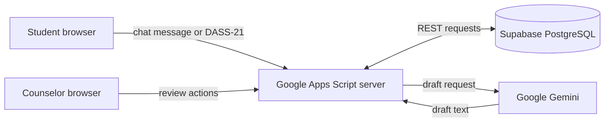

# MindBridge

**A student mental-wellness support and counselor decision-support web application.**

MindBridge gives students a private place to chat about everyday wellness concerns and take a weekly DASS-21 screening, and gives guidance counselors one place to review what needs their attention. A counselor always makes the final decision. The AI only prepares a *draft* that a counselor must approve, edit, or reject.

> **Important:** MindBridge is an academic prototype. It is **not** a diagnostic tool and **not** an emergency service. See [Current limitations](#current-limitations).

---

## Team

| Role | Name |
| --- | --- |
| Team Leader | Tabelon, Allondra Mae |
| Member | Gayo, John Carlo M. |
| Member | Basco, Ana Leah |
| Member | Hidalgo, Mark Daryl |
| Member | Villanueva, Aldrin |

Project type: BSCS thesis / system-analysis project  
Repository: <https://github.com/Arzynn/MindBridge-Thesis>  
Live demo: https://script.google.com/macros/s/AKfycbwjm2nJ4x4hQxKvXj2SojTzNdc0B94_1WdhAQ6XvVxdSEPbeDmARRPX472i6qHRpAKL_A/exec 

Adviser / institution: Sir Zee

---

## What the system does

### For students
- **Register and sign in** with a student number, course, year level, school email, and password. Registration requires agreeing to a consent checkbox.
- **AI Wellness Chatbot:** send a message about stress, sleep, motivation, or similar concerns. The system prepares a supportive draft reply, but the draft goes to a counselor for review.
- **Weekly Screening (DASS-21):** a 21-question depression, anxiety, and stress questionnaire. Each student can submit once every rolling seven days. Students see only that they took part, not scores or severity labels.
- **My Wellness Progress:** history of past screening participation.
- **Wellness Resources:** counselor-approved resources and a "contact human support" section.
- **My Profile:** the student's account details.

### For counselors
- **Dashboard:** recent risk notifications, the weekly screening trend, and recent review actions.
- **AI response reviews:** read the student's message and the AI draft, then **approve**, **edit**, or **reject** it.
- **Screening reviews:** see DASS-21 results per subscale and move each one through review statuses.
- **Risk monitoring:** see risk notifications (from chat risk phrases or high screening scores) and update their status.
- **Students, Reports, Wellness resources, My profile:** student records, summary counts and trends, approved resources, and the counselor's own profile.

### Safety behavior built into the chat
1. Messages longer than 2,000 characters are rejected.
2. Messages outside the wellness scope get a polite fallback reply.
3. If a message contains a configured risk phrase, the system creates a **pending risk flag** for counselors and shows the configured support contacts to the student. No AI draft is generated in that case.
4. Otherwise, the message plus counselor-approved guidance goes to Google Gemini to draft a reply. The draft waits for a counselor.
5. If Gemini is unavailable, the message is still saved and queued for a counselor to answer manually.

---

## How to use it

### As a student
1. Open the web-app link. The login page appears first.
2. Click **Register here**, fill in the form (password: 8 to 128 characters), tick the consent box, and submit.
3. Sign in with your email and password. You land on the **Dashboard**.
4. Use the top navigation: **AI Wellness Chatbot** to chat, **Weekly Screening** to take the DASS-21, **My Wellness Progress** to view your history, **Wellness Resources** for help and materials.
5. Click **Logout** when done.

### As a counselor
1. On the login page click **Counselor access?** to reach the counselor login.
2. Sign in with a counselor account. Counselor accounts are **created by the system administrators in the database**; the counselor registration page is informational only.
3. Start at the **Dashboard**, then open **AI response reviews** to handle student chat drafts and **Risk monitoring** / **Screening reviews** for flagged items.
4. For each item, choose a status or action. Reviews are recorded with who reviewed and when.

### Review statuses

| Item | Allowed progression |
| --- | --- |
| Risk flag (chat) | Pending, then Reviewed, Follow-up, or Closed |
| DASS-21 screening | Pending, then Reviewed or Follow-up; Reviewed, then Follow-up or Closed; Follow-up, then Closed |
| AI draft | Pending, then Approved, Edited, or Rejected |

---

## How it works



The browser pages call server functions in Google Apps Script. The server checks the session and role, reads and writes the Supabase database, and, only for ordinary chat messages, asks Gemini for a draft reply.

| Layer | Technology |
| --- | --- |
| Frontend | HTML, CSS, JavaScript (Bootstrap 5) |
| Backend / web app | Google Apps Script (`.gs` files) |
| Database | Supabase (PostgreSQL) through its REST API |
| AI drafts | Google Gemini |
| Build | Node.js (no extra packages needed) |

---

## Project structure

```text
MindBridge/
├── backend/       Maintained server source (Apps Script .gs files)
├── frontend/      Maintained pages, styles, and browser JavaScript
├── apps-script/   Generated deployment files (do not edit by hand)
├── database/      Supabase schema, policies, grants, migrations
├── docs/          Setup, testing, architecture, and system-analysis documents
├── tests/         Node.js unit tests
├── build-gas.js   Builds apps-script/ from backend/ and frontend/
├── .clasp.json.example
└── .env.example
```

`backend/` and `frontend/` are the source of truth. `apps-script/` is generated by `node build-gas.js` and is excluded from Git so there is only one editable copy.

### Documentation
- [`docs/setup.md`](docs/setup.md): full deployment steps.
- [`docs/architecture.md`](docs/architecture.md): data flow and feature boundaries.
- [`docs/testing.md`](docs/testing.md): test plan.
- [`docs/system-analysis/`](docs/system-analysis/README.md): DFDs, ERD, data dictionary, structure chart, HIPO, Structured English, pseudocode, and configuration management plan.

---

## Setup for developers

**You need:** Node.js, a Supabase project, a Google Apps Script project, and optionally `clasp`. Use a test project and synthetic data only.

1. **Database.** In the Supabase SQL editor run `database/schema.sql`, then `database/policies.sql`, then `database/service_role_grants.sql`. Do not rerun the first two on an existing database. A database created from an older schema also needs the DASS-21 migration in `database/migrations/`.
2. **Script Properties.** In Apps Script open **Project Settings, Script Properties** and add these. They are never stored in the repository:

   | Property | Purpose |
   | --- | --- |
   | `SUPABASE_URL` | Supabase project URL |
   | `SUPABASE_SERVICE_ROLE_KEY` | Server-side database key |
   | `GEMINI_API_KEY` | Gemini API key |
   | `DASS21_CONSENT_TEXT` | Approved consent wording (needed to enable DASS-21) |
   | `DASS21_REVIEW_POLICY_APPROVED` | Set to `true` only after the review policy is approved |

3. **Build.** From the project root:

   ```powershell
   node .\build-gas.js
   ```

4. **Deploy.** Upload everything in `apps-script/` to the Apps Script project (manually or with `clasp push`), run `checkSupabaseConnection` once from the editor, then choose **Deploy, New deployment, Web app**. Details are in [`docs/setup.md`](docs/setup.md).

   To use `clasp`, copy `.clasp.json.example` to `.clasp.json`, put in your own project ID, and keep it out of Git.

5. **Create a counselor account** directly in the database (users and counselor profile records), since the app has no counselor sign-up.

### Running the tests

```powershell
node --test tests\dass21.test.js
```

These cover DASS-21 scoring, answer validation, submission rules, and review transitions. They do not test a live deployment, Supabase, Gemini, or browser rendering.

---

## Current limitations

This is a prototype, and we list its known limits honestly:

- **Not for real student data yet.** Institutional privacy, consent, and counselor-access policies still need review.
- **Not an emergency service.** The configured support-contact numbers in `backend/Code.gs` are placeholders and must be replaced with verified contacts before real use.
- **DASS-21 is gated.** Submissions stay disabled until the approved consent text and the review-policy setting are configured. The instrument version and permission to use it should be confirmed with the research adviser.
- **Chat replies.** Approved counselor replies are saved by the server, but the student chat page does not yet load them back. This is planned work.
- **Passwords.** Passwords use a single salted SHA-256 hash, and login still accepts legacy plain-text records. This is not production-grade. Login rate limiting is not implemented.
- **Counselor access.** Any signed-in counselor can see all student records; there is no counselor-to-student assignment.
- **Database writes** span several requests and are not transactional.
- **Deployment access.** The generated manifest allows anonymous web-app access. Restrict it before handling real student data.
- **Follow-ups.** Follow-up notes, appointment scheduling, and email or SMS notifications are not implemented. Notifications are an in-app queue only.
- **AI use.** Student chat text and approved guidance are sent to Gemini. Check approval, consent, and data-retention terms before using real data.

---

## Security notes
- Never commit secrets. Keys live only in Apps Script Script Properties; `.env.example` lists names only, and the app does not read a local `.env` file.
- The Supabase service-role key bypasses Row Level Security, so authorization depends on the server's session and role checks. Keep those checks in every new endpoint.
