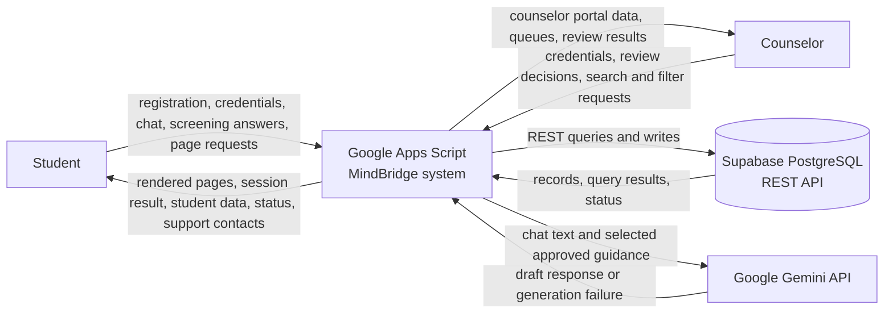
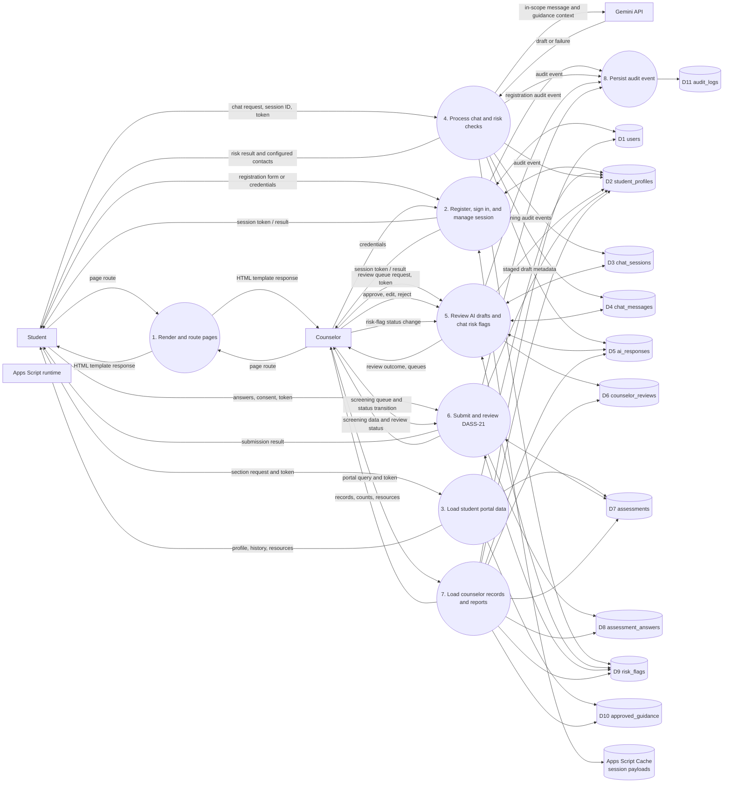
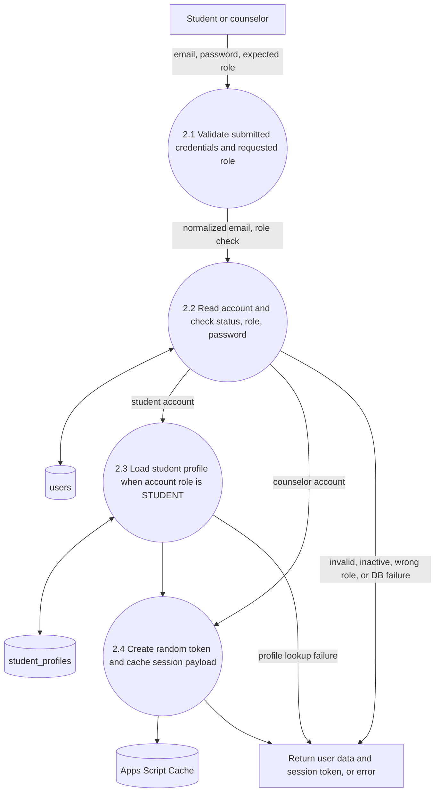
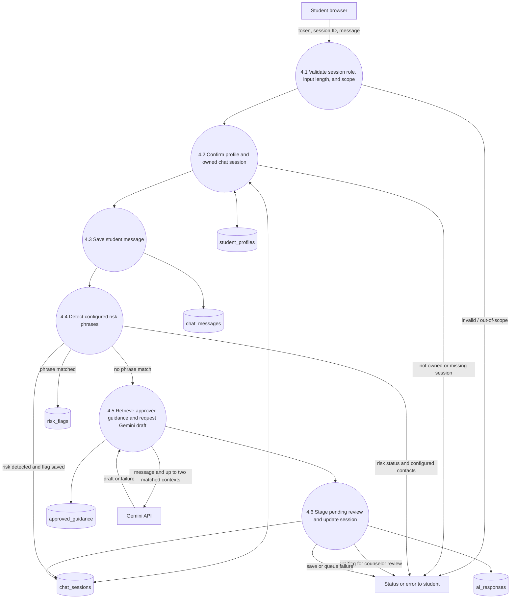
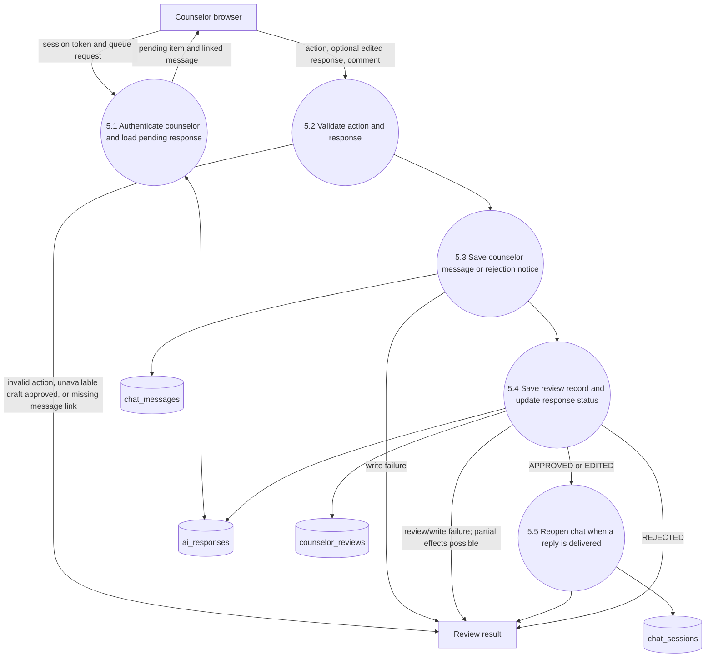
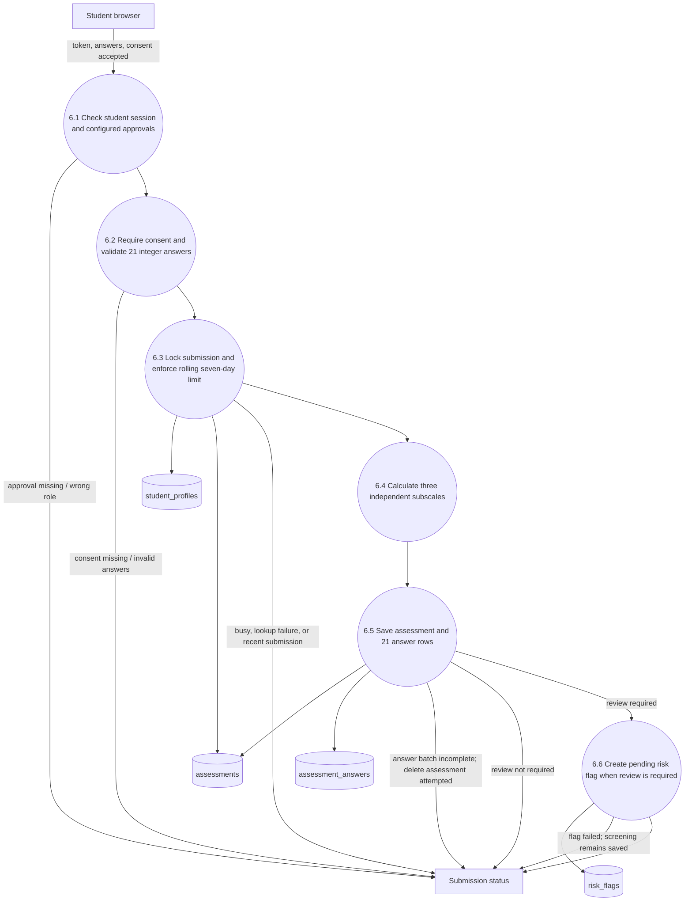
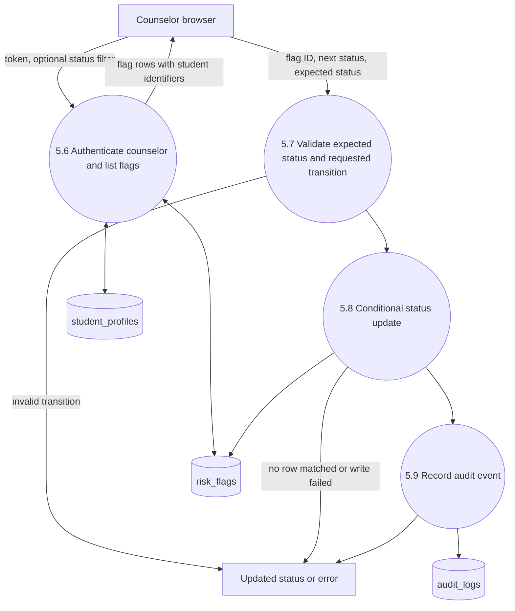
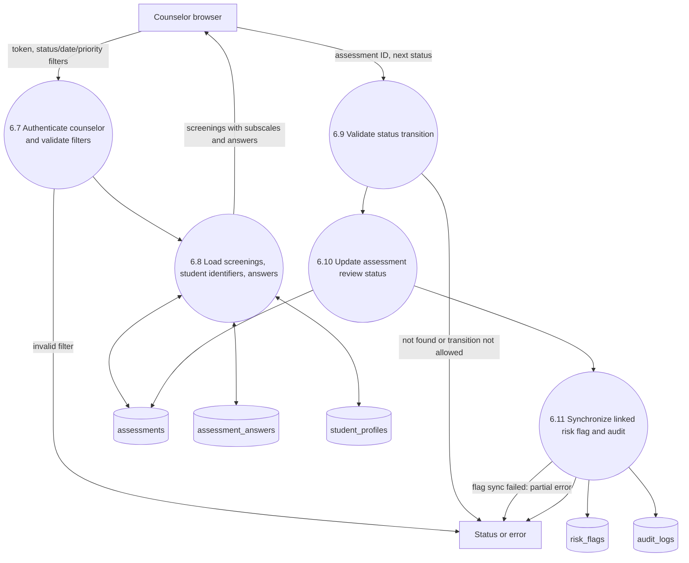

# Data Flow Diagrams

## Purpose and notation

These diagrams show verified data exchanges between actors, application
processes, external services, and persistent stores. They are logical views:
Apps Script helper functions and PostgREST requests are grouped for readability.

**Legend**

- Rounded boxes: external actors or services
- Numbered processes: MindBridge processes
- `D#`: persistent Supabase data store
- Arrows: data exchanged; arrow direction indicates flow direction
- DFD numbering here uses context as Level 0, the decomposition as Level 1,
  and detailed workflows as Level 2

## Level 0 — Context

**Boundary note:** Supabase and Gemini are external services. Apps Script is the
server-side application boundary. The diagram does not imply that Gemini output
is directly delivered to students; drafts are staged for counselor review.

## Level 1 — Major processes and stores

### Store descriptions

| Store | SQL table / component | Purpose |
| --- | --- | --- |
| D1 | `users` | Account, role, and status |
| D2 | `student_profiles` | Student-specific identity/profile |
| D3 | `chat_sessions` | Student chat conversation state |
| D4 | `chat_messages` | Student, counselor, or system messages |
| D5 | `ai_responses` | Pending AI draft and review state |
| D6 | `counselor_reviews` | Counselor decision record for an AI response |
| D7 | `assessments` | Screening metadata and subscale scores |
| D8 | `assessment_answers` | Individual screening answers |
| D9 | `risk_flags` | Risk notifications and their review status |
| D10 | `approved_guidance` | Approved content and retrieval keywords |
| D11 | `audit_logs` | Application audit events |
| Session | Apps Script Cache | Short-lived session token to user payload mapping |

**Balance note:** each Level 1 process `Pn` is decomposed in Level 2 as nodes
`n.1`, `n.2`, ... (for example `P4` becomes `4.1`-`4.6`). External flows that
enter or leave a Level 2 diagram are the same flows shown on the matching
Level 1 process. Database writes are separate REST calls; they are not one
transaction. `P8` denotes events recorded where the code calls `AuditLog`
(registration, risk-flag raise, AI draft staged/unavailable, counselor review,
risk-flag review, DASS-21 completion and review). Counselor *read* operations
(`P7`) write no audit events in the inspected code.

**Known gap in the data flow (verified by absence):** no backend function reads
`chat_messages` for the student. A counselor-approved reply or SYSTEM notice is
stored in `D4` by `P5`, but no implemented flow returns it to the student's
browser. The student chat page only shows messages typed in the current page
session plus the status text returned by `processStudentMessage`. Do not draw a
`D4 -> Student` flow until such an endpoint exists.

**Process-to-function map**

| Process | Source functions |
| --- | --- |
| P1 | `Code.gs: doGet`, `include` |
| P2 | `Auth.gs: loginUser`, `getAuthenticatedUser_`, `logoutUser`; `Student.gs: registerStudent` |
| P3 | `Code.gs: getStudentPortalData`, `getDASS21ScreeningConfig` |
| P4 | `Chatbot.gs: getOrCreateActiveSession`, `processStudentMessage`; `ScopeControl`; `RiskDetection.checkChatMessage`; `GuidanceRetrieval`; `AIService.generateDraft` |
| P5 | `Counselor.gs: getPendingAIReviews`, `processCounselorReview`, `getPendingRiskFlags`, `processRiskFlagReview`; `Code.gs: getCounselorRiskFlags` |
| P6 | `Assessment.gs: submitStudentDASS21`; `Code.gs: getCounselorScreenings`, `processDASS21ScreeningReview` |
| P7 | `Code.gs: getCounselorDashboardData`, `getCounselorStudents`, `getCounselorStudentRecord`, `getCounselorResources`, `getCounselorReports`, `getCounselorProfile` |
| P8 | `AuditLog.gs: record` (plus a direct `audit_logs` insert in `registerStudent`) |

## Level 2 — Authentication and student chat

### Level 2 for P2 — Sign-in

### Level 2 for P4 — Student chat request

**Implementation detail:** an AI failure can still create a pending `ai_responses`
row with model name `AI_UNAVAILABLE` and an empty draft so a counselor can
respond manually. If the database steps partially succeed, the process can
return an error after earlier records have been saved.

## Level 2 — Counselor review and DASS-21

### Level 2 for P5 — Counselor AI-response review

**Important:** the code performs multiple database requests without a shared
transaction. It may save a conversation message before a later review/status
write fails.

### Level 2 for P6 — DASS-21 student submission

The endpoint requires Script Properties `DASS21_CONSENT_TEXT` and
`DASS21_REVIEW_POLICY_APPROVED=true`, then requires the student's consent
boolean. Score bands and review routing still require institutional approval.

### Level 2 for P4 — risk-phrase branch (detail of node 4.4)

When a configured risk phrase matches, `RiskDetection.raiseRiskFlag` inserts a
`risk_flags` row (`trigger_type = RISK_LEXICON`, `severity = HIGH`, status
`PENDING`, session ID set), writes a `RISK_FLAG_RAISED` audit event, and, if the
insert succeeded, sets `chat_sessions.risk_flag = true`. `processStudentMessage_`
then sets `chat_sessions.status = WAITING_COUNSELOR` and returns the configured
support contacts. **No Gemini request is made on this branch**, and no
`ai_responses` row is created. The matched phrase is stored in
`risk_flags.trigger_value`; it is not shown on any diagram.

### Level 2 for P5 — Chat risk-flag review (counselor)

Allowed transitions in `processRiskFlagReview` (expected status defaults to
`PENDING`): `PENDING` to `REVIEWED`, `FOLLOW_UP`, or `CLOSED`; `REVIEWED` to
`FOLLOW_UP` or `CLOSED`; `FOLLOW_UP` to `CLOSED`. The update is filtered on the
expected current status, so a stale request updates nothing and returns an
error. The flag-review path does not message the student and does not contact
any emergency service.

### Level 2 for P6 — DASS-21 counselor screening review

`processDASS21ScreeningReview` allows `PENDING` to `REVIEWED` or `FOLLOW_UP`,
`REVIEWED` to `FOLLOW_UP` or `CLOSED`, and `FOLLOW_UP` to `CLOSED`. It updates
`assessments` (`review_status`, `reviewed_by`, `reviewed_at`) filtered on the
current status, then updates the linked `SCREENING_THRESHOLD` risk flag with the
same status. If the flag update affects no row, the function returns
`success: false, partial: true` even though the assessment status was already
saved, and no audit event is written in that case. Assessments in
`POLICY_PENDING` or `NOT_REQUIRED` have no allowed transition.

## Traceability and verified limits

- Routing and page response: `backend/Code.gs:doGet`.
- Authentication: `backend/Auth.gs:loginUser`,
  `getAuthenticatedUser_`, `logoutUser`.
- Chat and risk: `backend/Chatbot.gs`, `backend/RiskDetection.gs`,
  `backend/GuidanceRetrieval.gs`, and `backend/AIService.gs`.
- Counselor actions: `backend/Counselor.gs`; counselor screening and portal
  queries: `backend/Code.gs`.
- DASS-21: `backend/Assessment.gs`.
- Stores: `database/schema.sql` and
  `database/migrations/20261004_dass21_screening.sql`.
- Client/server mechanism: `frontend/js/ui.js` and page scripts use
  `google.script.run`.

Level 2 node numbers for the review diagrams (5.6-5.9, 6.7-6.11) continue the
numbering of the matching Level 2 diagram for the same Level 1 process.

The DFDs do not claim production access restrictions, clinical validity,
transactional writes, or successful live connectivity. The generated manifest
allows anonymous web-app access; deployment configuration must be reviewed
separately.
