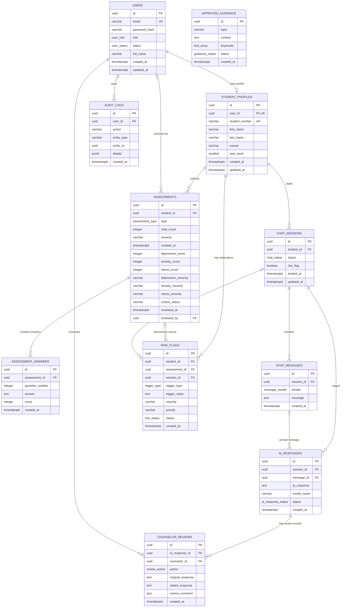

# Entity-Relationship Diagram

## Purpose and notation

This ERD is based on the foreign keys in `database/schema.sql` and the
DASS-21-related fields/indexes in
`database/migrations/20261004_dass21_screening.sql`.

- `||` means exactly one parent row is required.
- `o|` means an optional parent row.
- `o{` means zero or many child rows.
- `|{` means one or many child rows.
- `PK`, `FK`, and `UQ` label primary, foreign, and unique keys.

## Mermaid ERD

`APPROVED_GUIDANCE` has no foreign-key relationship in the supplied schema; its
keyword/content match is performed in application code. `AUDIT_LOGS.entity_id`
is not declared as a foreign key because it can refer to different entity
tables.

## Relationship and deletion rules

| Parent → child | Cardinality | Foreign key behavior |
| --- | --- | --- |
| `users` → `student_profiles` | One user to zero or one profile; profile requires one user | `student_profiles.user_id` is unique and cascades on user deletion |
| `student_profiles` → `assessments` | One profile to zero or many assessments | Cascades on profile deletion |
| `assessments` → `assessment_answers` | One assessment to zero or many answers | Cascades on assessment deletion |
| `student_profiles` → `chat_sessions` | One profile to zero or many sessions | Cascades on profile deletion |
| `chat_sessions` → `chat_messages` | One session to zero or many messages | Cascades on session deletion |
| `chat_sessions` → `ai_responses` | One session to zero or many response records | Cascades on session deletion |
| `chat_messages` → `ai_responses` | One message may be linked by zero or many response records; response link optional | Deleting message sets `message_id` null |
| `ai_responses` → `counselor_reviews` | One response to zero or many review records | Cascades on response deletion |
| `users` → `counselor_reviews` | One user to zero or many reviews | Cascades on counselor deletion |
| `student_profiles` → `risk_flags` | One profile to zero or many flags | Cascades on profile deletion |
| `assessments` → `risk_flags` | One assessment to zero or many flags; flag link optional | Cascades on assessment deletion |
| `chat_sessions` → `risk_flags` | One session to zero or many flags; flag link optional | Deleting session sets `session_id` null |
| `users` → `assessments` | One user to zero or many reviewed assessments; reviewer link optional | Deleting reviewer sets `reviewed_by` null |
| `users` → `audit_logs` | One user to zero or many events; actor link optional | Deleting user sets `user_id` null |

The ERD does not show the apps-script Cache session mapping; it is not a
database entity.

## Important schema constraints

- `users.email`, `student_profiles.user_id`, and
  `student_profiles.student_number` are unique.
- `student_profiles.year_level` is constrained to 1–6.
- DASS-21 subscale scores are constrained to 0–42 (base schema and migration).
- `assessments.review_status` and `risk_flags.priority` have check constraints.
- A partial unique index prevents duplicate risk flags for the same non-null
  `(assessment_id, trigger_type)`.
- No uniqueness constraint on `(assessment_id, question_number)` is present in
  the supplied schema.

## Enum types

The schema defines `user_role`, `user_status`, `assessment_type`,
`chat_status`, `message_sender`, `ai_response_status`, `review_action`,
`trigger_type`, `risk_status`, and `guidance_status`. Values are listed in the
[Data Dictionary](data-dictionary.md).

## Enum types by column

| Enum type | Used by column | Values |
| --- | --- | --- |
| `user_role` | `users.role` | `STUDENT`, `COUNSELOR`, `ADMIN` |
| `user_status` | `users.status` | `ACTIVE`, `INACTIVE`, `SUSPENDED` |
| `assessment_type` | `assessments.type` | `DASS21`, `PHQ9`, `GAD7`, `PSS10` |
| `chat_status` | `chat_sessions.status` | `ACTIVE`, `WAITING_COUNSELOR`, `RESOLVED` |
| `message_sender` | `chat_messages.sender` | `STUDENT`, `AI`, `COUNSELOR`, `SYSTEM` |
| `ai_response_status` | `ai_responses.status` | `PENDING`, `APPROVED`, `EDITED`, `REJECTED` |
| `review_action` | `counselor_reviews.action` | `APPROVED`, `EDITED`, `REJECTED` |
| `trigger_type` | `risk_flags.trigger_type` | `PHQ9_ITEM9`, `SCREENING_THRESHOLD`, `RISK_LEXICON` |
| `risk_status` | `risk_flags.status` | `PENDING`, `REVIEWED`, `FOLLOW_UP`, `CLOSED` |
| `guidance_status` | `approved_guidance.status` | `DRAFT`, `APPROVED`, `DEACTIVATED` |

`assessments.review_status` and `risk_flags.priority` are `VARCHAR` columns
with CHECK constraints, not PostgreSQL enum types.

## RLS and authorization caveat

`database/policies.sql` enables RLS and defines policies based on
`current_app_user_id()` and `current_app_user_role()`. The backend calls
Supabase using a service-role key, which bypasses RLS. The diagram therefore
does not represent RLS as the authorization boundary for backend calls;
server-side session/role checks and each endpoint's scope are critical. Verify
the actual production configuration separately.

`Database.gs` also adds `app.current_user_id` and `app.current_user_role` as HTTP
request headers. The policies read PostgreSQL settings of the same names, and
this review could not confirm that a PostgREST request header sets such a
setting (to our understanding PostgREST exposes request headers under
`request.headers`). Treat these headers as **unverified RLS context**, and
treat RLS as defence in depth that is not exercised by service-role calls.

## Traceability

- Foreign keys and base entities: `database/schema.sql`.
- DASS-21 migration: `database/migrations/20261004_dass21_screening.sql`.
- RLS policy definitions: `database/policies.sql`.
- Application relationships in use: `backend/Assessment.gs`, `Chatbot.gs`,
  `Counselor.gs`, and `Code.gs`.
- ERD reflects repository SQL, not a live database introspection.
