# HIPO — Hierarchy plus Input-Process-Output

## Purpose and notation

HIPO organizes the system into a functional hierarchy and summarizes the inputs,
processing, and outputs for important functions. The diagram summarizes
implemented flows and distinguishes protected operations.

## Hierarchy diagram

```mermaid
flowchart TD
    MB[MindBridge]
    MB --> Web[1. Serve web pages]
    MB --> Identity[2. Identity and sessions]
    MB --> Student[3. Student services]
    MB --> Counselor[4. Counselor services]
    MB --> Data[5. Persistence and integrations]

    Web --> Route[1.1 Route page using query parameter]
    Web --> Template[1.2 Render HtmlService template and includes]

    Identity --> Register[2.1 Register student]
    Identity --> Login[2.2 Sign in by expected role]
    Identity --> Check[2.3 Verify cached session and role]
    Identity --> Logout[2.4 Remove cached session]

    Student --> Portal[3.1 Load profile, history, or resources]
    Student --> Chat[3.2 Validate and process chat]
    Student --> Detect[3.3 Detect configured chat-risk phrase]
    Student --> Draft[3.4 Retrieve context and stage Gemini draft]
    Student --> Screen[3.5 Submit DASS-21 when approvals are configured]

    Counselor --> Queue[4.1 Load pending AI review]
    Counselor --> Review[4.2 Approve, edit, or reject response]
    Counselor --> RiskQueue[4.3 Load and transition risk flags]
    Counselor --> Record[4.4 Load student, screening, and report data]
    Counselor --> ScreenReview[4.5 Transition DASS-21 screening review status]

    Data --> DB[5.1 Supabase REST operations]
    Data --> AI[5.2 Gemini draft generation]
    Data --> Audit[5.3 Audit-event insertion]
    Data --> Config[5.4 Apps Script Script Properties and Cache]
```

## HIPO input-process-output summary

| ID / function | Preconditions | Input | Processing | Output |
| --- | --- | --- | --- | --- |
| 1.1 `doGet(e)` | Apps Script web app request | Optional `page` query value | Select known route, default to login, populate template variables | Rendered HTML response |
| 2.1 `registerStudent(formData)` | Public registration page; DB config available | Email, password, student number, name, course, year | Validate required values, institutional email pattern, lengths, password length and year; check duplicates; insert user and profile; attempt audit | Success message or failure message |
| 2.2 `loginUser(email,password,expectedRole)` | Student or counselor login page | Email, password, expected role | Normalize email; query user; check status, role, password; load student profile when student; cache user session under generated UUID | User payload and bearer session token, or error |
| 2.3 `getAuthenticatedUser_(token,role)` | Protected server call | Session token, required role | Validate token shape; read cache; parse payload; check user and role | Authenticated user payload or thrown authorization/session error |
| 3.1 `getStudentPortalData(token,section)` | Valid student session | Section key | Validate section; load own profile; optionally load assessment history or approved resources | Section data or explicit error |
| 3.2 `processStudentMessage(token,sessionId,text)` | Valid student session and owned chat session | Chat session ID and up to 2,000-character message | Validate text/scope and ownership; persist message; dispatch risk check or AI/manual review staging | Status, message, optional configured support contacts |
| 3.3 `RiskDetection.checkChatMessage(...)` | Valid message and user context | Message text, student/session IDs | Search configured phrase list; insert pending flag when matched; update session risk indicator on successful insert | Risk detected/queued status |
| 3.4 `GuidanceRetrieval.getRelevantGuidance` + `AIService.generateDraft` | No chat phrase matched; required provider config available | Message and approved guidance store | Match keywords; use up to two matched contexts in a prompt; call Gemini | Draft/model or failure code |
| 4.1 `getPendingAIReviews(token)` | Valid counselor session | Session token | Load pending AI responses and resolve linked messages, sessions, student profiles | Review queue entries |
| 4.2 `processCounselorReview(token,id,action,...)` | Valid counselor session; pending response exists | Action, optional edited response/comment | Validate action; save counselor/system message; save review; update response status; reopen session for delivered reply | Success/failure, with possible partial side effects |
| 4.3 `processRiskFlagReview(token,id,status,expected)` | Valid counselor session | Flag ID, allowed next status, optional expected current status (default `PENDING`) | Validate transition; update only if expected current status matches; audit transition | Updated status or error |
| 3.5 `Assessment.submitDASS21(token,answers,consent)` | Student session; approved consent text and policy setting; accepted consent | Exactly 21 integer answers 0–3 | Acquire script lock; confirm profile; check rolling seven-day duplicate; calculate independent subscales; write assessment and answers; create review flag if needed | Saved/rejected result, possibly partial-save warning |
| 4.4 Counselor data operations (`getCounselorDashboardData`, `getCounselorStudents`, `getCounselorStudentRecord`, `getCounselorScreenings`, `getCounselorRiskFlags`, `getCounselorResources`, `getCounselorReports`, `getCounselorProfile`) | Valid counselor session | Filters, IDs, date ranges | Validate filters; query data (limits of 100-500 rows, 5,000 for the trend query); assemble records/counts | Counselor records and dashboards; no audit event is written |
| 4.5 `processDASS21ScreeningReview(token,assessmentId,nextStatus)` | Valid counselor session; assessment of type DASS21 in `PENDING`, `REVIEWED`, or `FOLLOW_UP` | Assessment ID, next status | Check allowed transition; update assessment filtered on current status; update linked risk flag; audit | New status, or error (partial-failure error if the flag update affects no row) |
| 5.1 `Database.*` | Required Supabase Script Properties | Table, filters, payload, context | Build REST URL/headers; call Supabase; parse response and status | Success/data or explicit error object |
| 5.2 `AIService.generateDraft` | Gemini API key configured | Prompt containing message and selected context | POST to configured Gemini endpoint; validate response shape | Draft or sanitized error result |
| 5.3 `AuditLog.record` | Caller emits audit-worthy event | Actor, action, entity, details | Shape audit payload and insert | Insert attempted; result is not returned to the original caller |

## Data and control notes

- Session expiry is nominally one hour in Apps Script Cache (TTL 3600 s; the
  cache is not a guaranteed store, so earlier loss is possible).
- Sign-in accepts a stored credential equal to the typed password in addition
  to the salted SHA-256 format (see verification report F-03).
- Student/counselor role checks are server-side for protected operations.
- The backend makes multiple independent REST requests; no transaction spans
  them.
- `Assessment.submitDASS21` uses a script lock for duplicate-window checking.
- Registration creates a user before the profile; a profile insert failure can
  leave an account without a profile.
- Audit insertion results are not checked by `AuditLog.record`.

## Verified vs. incomplete

The counselor registration page exists, but its script only shows a message that
self-registration is not connected to an account-creation service, and the
reviewed backend has no counselor registration endpoint (counselor accounts
must be provisioned outside this application).
The student chat page does not display counselor replies: no endpoint returns
`chat_messages` to a student. DASS-21 submission requires approval settings.
No emergency-response dispatch, email/SMS notification delivery, or independent
clinical assessment service was verified.

## Traceability

`backend/Code.gs`, `Auth.gs`, `Student.gs`, `Chatbot.gs`, `Assessment.gs`,
`Counselor.gs`, `RiskDetection.gs`, `GuidanceRetrieval.gs`, `AIService.gs`,
`Database.gs`, `AuditLog.gs`; matching source forms/pages in `frontend/`;
tables in `database/schema.sql`.
