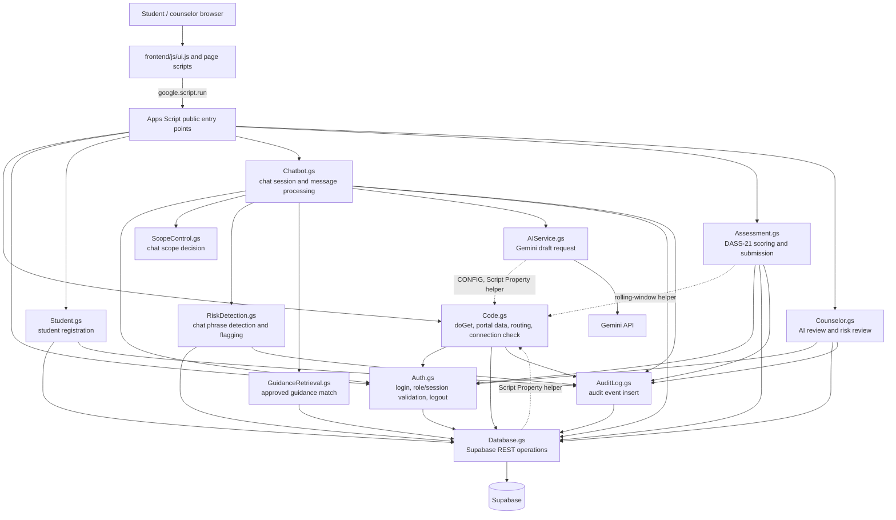

# Structure Chart

## Purpose and notation

The chart groups the actual Apps Script modules by responsibility and shows
their important call relationships. It is not a complete inventory of every
helper. Browser pages call public Apps Script functions through
`google.script.run`. Apps Script runs all `.gs` files in one shared global
scope, so a module can call a function defined in another file without an
import; the dashed edges show these shared helpers (`CONFIG`,
`getRequiredScriptProperty_`, `getCurrentRollingScreeningWindow_`, all defined
in `Code.gs`).

- Top-down edges indicate a call or orchestration relationship verified in
  source, or a client-to-server entrypoint.
- Dashed dependencies denote shared services/collaborators.
- `*` indicates a service used from more than one module.

## Module hierarchy

## Responsibility table

| Module | Main verified responsibilities | Main collaborators |
| --- | --- | --- |
| `Code.gs` | `doGet()` page routing; student portal data; DASS-21 configuration; counselor portal queries/reports/status transitions; include helper; required Script Properties; Supabase connection check | `Auth`, `Database`, `AuditLog` |
| `Auth.gs` | Normalize login input, query account, validate role/status/password, cache session, validate role/session, logout | `Database`, Apps Script Cache |
| `Student.gs` | Validate student registration fields, prevent known duplicate email/student number, insert account/profile, audit registration | `Database`, `AuditLog` |
| `Chatbot.gs` | Find/create active student session; verify session owner; save chat; handle risk branch; queue AI or manual review | `Auth`, `ScopeControl`, `RiskDetection`, `GuidanceRetrieval`, `AIService`, `Database`, `AuditLog` |
| `Assessment.gs` | Validate DASS-21 answers/consent; calculate subscales; lock and enforce seven-day repeat window; save assessment/answers/risk flag | `Auth`, `Database`, `AuditLog`, Apps Script Lock |
| `Counselor.gs` | Load pending AI/risk queues; approve/edit/reject AI response; transition risk-flag state | `Auth`, `Database`, `AuditLog` |
| `RiskDetection.gs` | Check configured chat lexicon and legacy PHQ-9/GAD-7 thresholds; create flags and mark session risk state | `Database`, `AuditLog`, `CONFIG` |
| `ScopeControl.gs` | Decide whether a chat request matches supported wellness scope and return fallback | `CONFIG` |
| `GuidanceRetrieval.gs` | Fetch approved guidance, simple keyword matching, return up to two content blocks | `Database` |
| `AIService.gs` | Construct non-diagnostic prompt and call configured Gemini model; report usable draft or sanitized failure result | `UrlFetchApp`, Script Properties, `CONFIG` |
| `Database.gs` | Supabase REST `select`, `insert`, `update`, `delete`, exact count, and connection check | `UrlFetchApp`, Script Properties |
| `AuditLog.gs` | Format and insert audit event records | `Database` |

## Public operation groups

These are callable operations, not all of the private helpers:

| User-facing operation | Main entrypoints | Source |
| --- | --- | --- |
| Serve routed page | `doGet`, `include` | `Code.gs` |
| Student/counselor login and sign-out | `loginUser`, `logoutUser` | `Auth.gs` |
| Register student | `registerStudent` | `Student.gs` |
| Student portal content | `getStudentPortalData`, `getDASS21ScreeningConfig` | `Code.gs` |
| Student chat | `getOrCreateActiveSession`, `processStudentMessage` | `Chatbot.gs` |
| Submit DASS-21 | `submitStudentDASS21` | `Assessment.gs` |
| Counselor AI queue | `getPendingAIReviews`, `processCounselorReview` | `Counselor.gs` |
| Counselor chat-risk queue | `getPendingRiskFlags`, `processRiskFlagReview` | `Counselor.gs` |
| Counselor screening/records/reports | `getCounselorDashboardData`, `getCounselorStudents`, `getCounselorStudentRecord`, `getCounselorScreenings`, `getCounselorRiskFlags`, `getCounselorResources`, `getCounselorReports`, `getCounselorProfile`, `processDASS21ScreeningReview` | `Code.gs` |
| Test database connection | `checkSupabaseConnection` | `Code.gs` |

## Build/deployment structure

`build-gas.js` was **not included in the archive reviewed** for this revision, so
its logic is not verified. What the supplied `apps-script/` output shows: the 12
`.gs` files are byte-identical to `backend/*.gs`; each `frontend/*/*.html` page
appears as a flat HTML include (for example `student/login.html` as
`StudentLogin.html`); `frontend/js/ui.js` appears wrapped in `<script>` as
`JavaScript.html`; `frontend/style.css` as `Styles.html`; and `Index.html` is a
template that includes the page named by `doGet`. Generated files are
deployment copies, not a second module hierarchy.

## Unreferenced or manually run code (no caller found in the supplied source)

| Function | Observation |
| --- | --- |
| `RiskDetection.checkAssessment` | PHQ-9 item 9 and PHQ-9/GAD-7 threshold logic; no caller, and `submitAssessment` accepts DASS-21 only |
| `Assessment.submitAssessment` | Public member of the module object, but only `submitStudentDASS21` is a global entry point |
| `Code.gs: checkSupabaseConnection` | Not called by any page; intended to be run manually from the Apps Script editor |

## Verified vs. incomplete

- No backend function returns `chat_messages` to a student, so a
  counselor-approved reply is stored but not shown to the student by the current
  chat page.

- Student registration and login have server-side functions.
- Counselor registration is a static prototype; no account-provisioning
  endpoint was verified.
- Assessment submission currently accepts DASS-21 only, although enum values
  and some risk-detection code include other instruments.
- AI drafts are staged for counselor review; AI does not directly answer the
  student in this workflow.
- Calls that perform several REST operations can partially succeed; no
  cross-request transaction is implemented.

## Traceability

Function/module names above are in `backend/*.gs`; browser invocation pattern
is in `frontend/js/ui.js` and page scripts; source-to-output mapping was inferred by comparing `backend/` and `frontend/`
with the generated `apps-script/` files; `build-gas.js` was not in the reviewed
archive.
